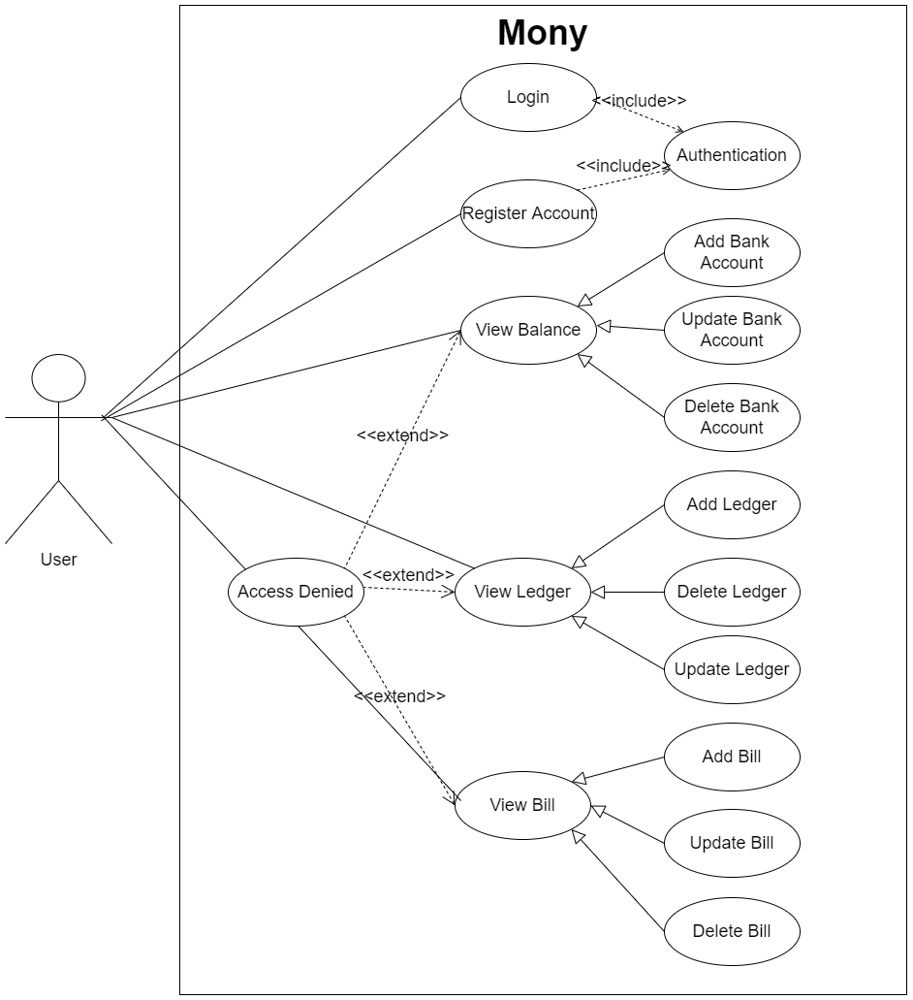
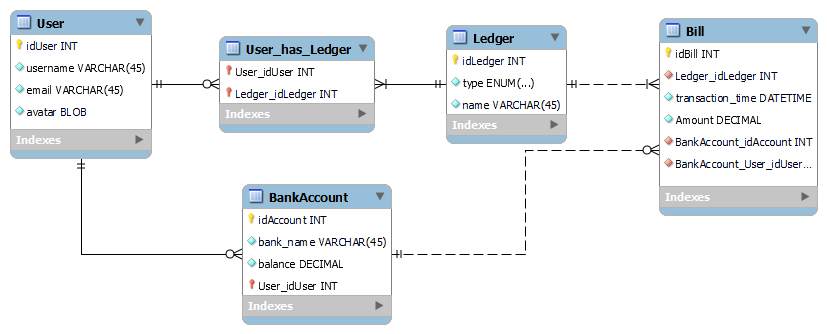
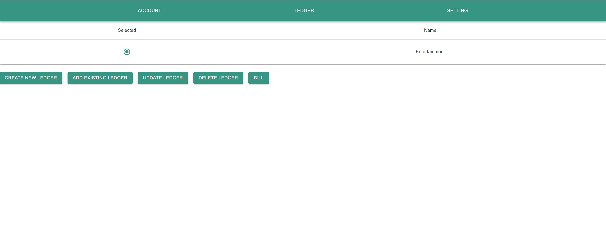
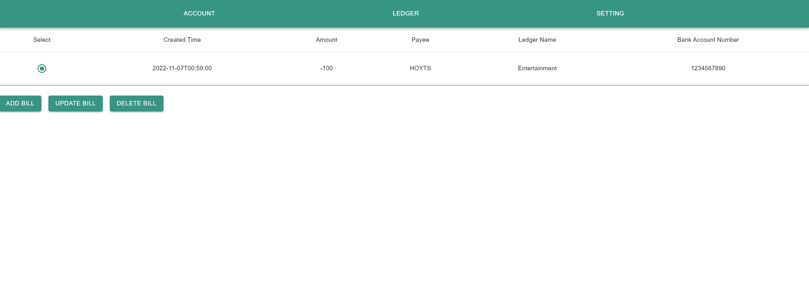

# Mony
Mony is an online ledger platform that allows users to track daily income and expense. Ledgers can be shared with your friends, families or business partners!

## Technologies

Database: MySQL

Backend: Spring Boot, Spring JPA, Spring Security, JWT, RESTful

Frontend: React.js, MUI

## Use Case Diagram

## ER Diagram

## Screenshots
### Login Page

### Add a ledger

### Log a bill

